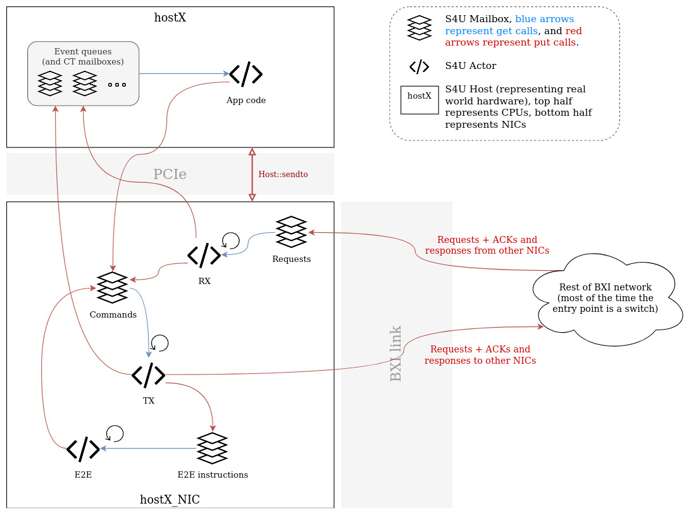

# Network model {#NetworkModel}

**⚠ Some of this is probably outdated ⚠**  
*I mean, most of it is probably close to the truth, but I haven't checked, and it needs some rewriting anyway. So come back later for more up to date infos. If you really want to know how our model works, the best source of information is probably [this paper](https://hal.inria.fr/hal-02972297) rather than our documentation for now*

## Modifications to S4U's workflow

The initiator doesn't use the target's mailbox directly to communicate, it has to issue its command to its *NIC*, which will wrap the message in a custom data structure, and send it to the target's *NIC*. The target's *NIC* will then process the message using the standard Portals4 workflow (match entry, write to MD, post event, send ACK, etc.).

The platform description file must be modified :
* Each actor is divided in four : a *main* actor, a *NIC TX* actor, a *NIC RX* actor and a *NIC_E2E* actor
* The links that used to connect main actors to the network now connect *NIC* actors to the rest of the network (usually to a router)
* Each *main actor* is now exclusively connected to its corresponding *NIC actors* through a fast link that models a PCIe 3.0 x16 port

The behaviour of the *main* actor is similar to the one of the former single actor (describes the application)

The behaviour of the *NIC* actors is defined by the wrapper and models Portals' behaviour using several daemon actors :
* RX actor is an infinite loop that listens to the network for incoming requests and processes it through the MD / EQ / etc. system
* TX actor is an infinite loop that listens to commands from the main actor and issues the corresponding requests to the network
* E2E actor is an infinite loop that listens to instructions from the TX actor : when it gets a message, it waits until the timeout is reached and then determines if the messages needs to be re-transmitted or not

## Mailboxes

To do all that, the actors share several mailboxes : 
* A *Request* mailbox for *RX*, which is targeted by other nodes when sending requests or responses (including ACKs)
* A *Command* mailbox for the main actor to issue instructions to be executed by *TX* (sometimes these commands can come from *RX*, to send a Portals ACK for example)
* An *E2E instructions* mailbox that allows the NIC Initiator (TX) to pass messages to the E2E actor
* Several *event* mailboxes that the main actor can query to get PUT, GET, SEND, ACK, REPLY, LINK etc. events. There is one of those mailboxes for each Portals EQ
* Several *CT* mailboxes that are used to wake up actors stuck on a `PtlCTPoll` (using a mechanism similar to EQs). There is not necessarily a mailbox for each CT, because they are needed only in case of a `PtlCTPoll` : `PtlCTGet` and `PtlCTWait` can be implemented in a more performant way (because counting events are simpler than full events, see Portals spec)

## New structure

## Performance / precision tradeoff

Several options allow the user to make faster simulations, by simplifying the model (and thus losing a bit of precision). These include (for each node) :

* __model_pci__ : If `false`, most (but not all, we still need to yield from times to times, which is good for both performance and precision) PCI communication are skipped. That determines wether we model inline messages and PIO / DMA difference. It can be set as a `<prop>` in the main actor of each node (default value is `true`)

* __e2e_off__ : If true, no re-transmit logic is executed. There is no specific prop to set, if you want it `true` simply put no E2E actor in your deploy for the desired node, otherwise it will be `false`
